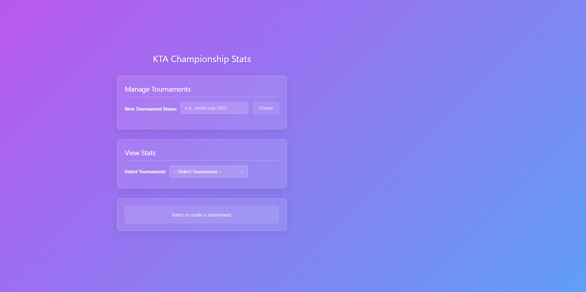

# KTA_Champ

For Dofus tournament stats during the tournament.

## How to use

1. Clone the repository
2. Install Server: Run `npm install`
3. Install Client: run `cd frontend && npm install`
4. Run `npm run dev` in root directory to start the server & client

